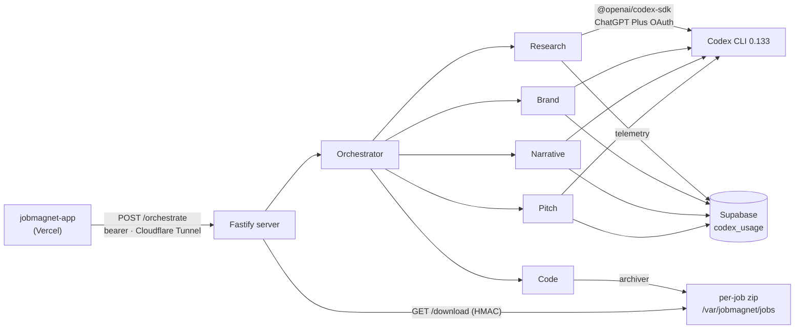

<div align="center">

# jobmagnet-codex

**The Codex SDK "engine room" for [JobMagnet](https://github.com/aksheyw/jobmagnet-app) — five specialized OpenAI Codex agents on a VPS that turn a profile + a job link into a deployable, on-brand portfolio site in ~96 seconds.**

[](https://github.com/aksheyw/jobmagnet-app)
[](LICENSE)
[](https://www.npmjs.com/package/@openai/codex-sdk)

</div>

---

## Why this is a separate service

This is the companion runtime to **[jobmagnet-app](https://github.com/aksheyw/jobmagnet-app)** (the Next.js UI + API on Vercel). It's separate **by force, not preference**: the Codex CLI is a **185 MB binary** — larger than Vercel's **50 MB** function limit — and the Code agent needs a persistent shell, a writable workspace, and ~96s of runtime. So the agent runtime can't live in a serverless function. It runs here: a **Fastify** server in a Docker container on a **Hostinger VPS**, reachable from Vercel over a **Cloudflare Tunnel** at `https://jobmagnet-codex.aksheywalia.in`.

## The 5 Codex agents

| Agent | Does | Codex SDK features |
|---|---|---|
| **Research** | Reads the JD → structured `JobContext` | `web_search` + network access, `outputSchema` |
| **Brand** | The company's real colors + fonts (Brandfetch → Codex fallback) | `web_search`, `outputSchema` |
| **Narrative** | Tailored headline, "why I'm a fit", cover letter | `outputSchema` |
| **Pitch** | A PM-RFC product critique + an SVG wireframe (4 stances) | `web_search`, **`workspace-write` sandbox**, `outputSchema` |
| **Code** | Copies a Next.js template, rewrites Tailwind/fonts/content, builds + zips | deterministic (0 LLM tokens) |

Every agent call logs input/output/cached/reasoning tokens + duration to Supabase `codex_usage`. For the MVP, generation runs via the Codex CLI's **ChatGPT Plus OAuth** (no per-token API cost during the hackathon); production would use an OpenAI API key.

## Routes

| Method | Path | Auth | Purpose |
|---|---|---|---|
| `GET` | `/health` | none | codex CLI version, OAuth status, workspace free MB |
| `POST` | `/orchestrate` | bearer | run the full 5-agent pipeline for a job (6/min) |
| `POST` | `/run-agent` | bearer | run a single named agent — dev/debug (10/min) |
| `GET` | `/download/:jobId` | HMAC-signed | stream the generated site zip (30/min) |

Bearer tokens are compared in constant time (`timingSafeEqual`). Per-route rate limits via `@fastify/rate-limit`.

## Architecture



## Tech stack

**Node 22** · **Fastify 5** · **`@openai/codex-sdk` 0.133** · **archiver** · **@supabase/supabase-js** · **Zod 3** · **@fastify/rate-limit** · Docker · Cloudflare Tunnel · ChatGPT Plus OAuth.

## Security

- Bearer auth on all non-health routes (constant-time comparison).
- Per-route rate limits.
- **SSRF guard** (`lib/url-validator.ts`) on every user-supplied URL — blocks non-http(s) schemes, localhost, internal/link-local IPs.
- Downloads are **HMAC-signed** with an expiry.
- Runs in an isolated Docker container; OAuth tokens + the bearer secret are read-only bind mounts, never baked into the image.

## Deploy (VPS)

```bash
ssh root@<your-vps-host>
cd /opt/jobmagnet-codex
git pull
docker compose build && docker compose up -d
docker compose logs -f --tail=50
```

**Bind mounts:**
- `/root/.codex` (ro) — ChatGPT Plus OAuth tokens, shared with the host Codex CLI.
- `/root/.jobmagnet/secret` (ro) — the bearer secret shared with the Vercel app.
- `/var/jobmagnet/jobs` (rw) — per-job workspaces + generated zips.

## License

[MIT](LICENSE) — © 2026 Akshey Walia

---

<div align="center">

The product this powers: **[jobmagnet-app](https://github.com/aksheyw/jobmagnet-app)** · built by [Akshey Walia](https://www.linkedin.com/in/aksheywalia/)

</div>
